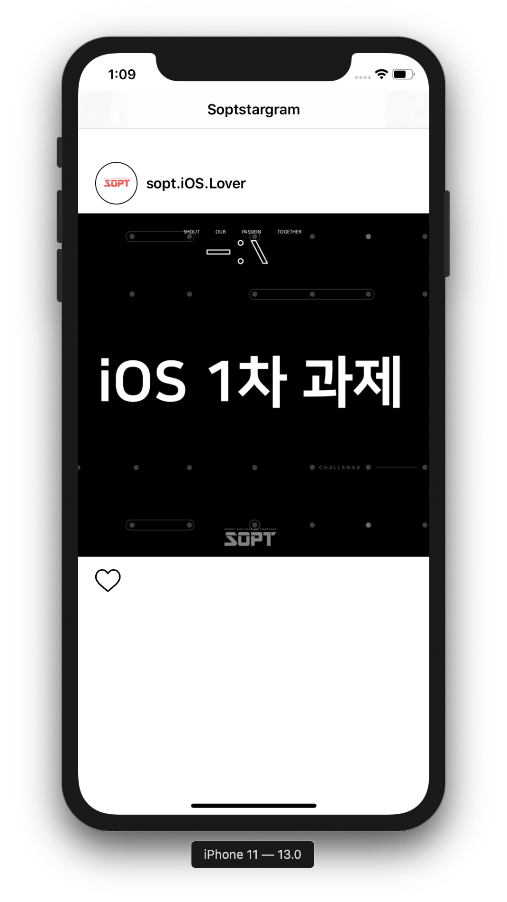
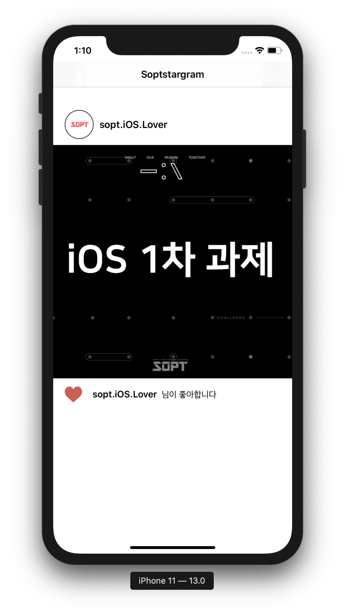
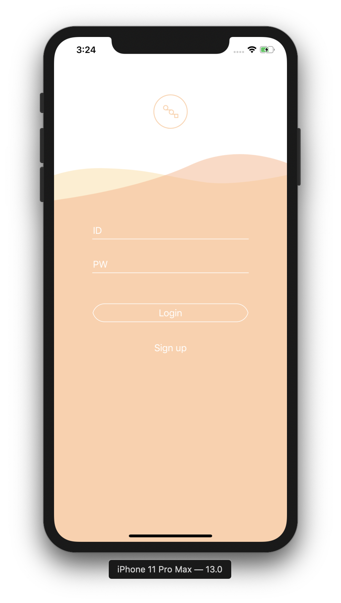
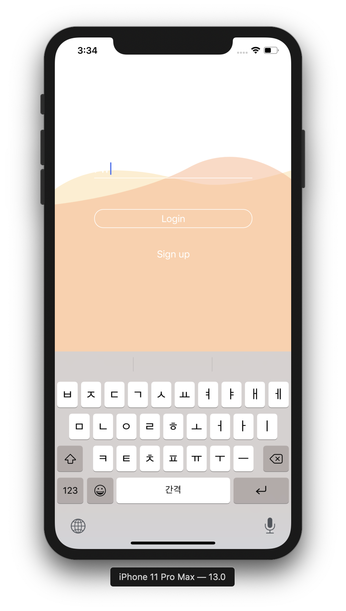
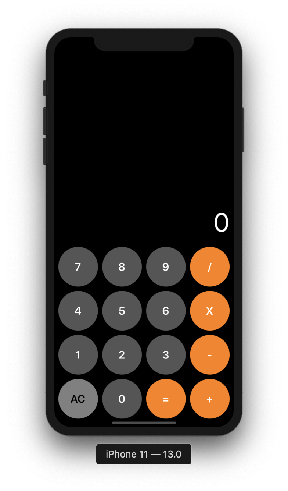
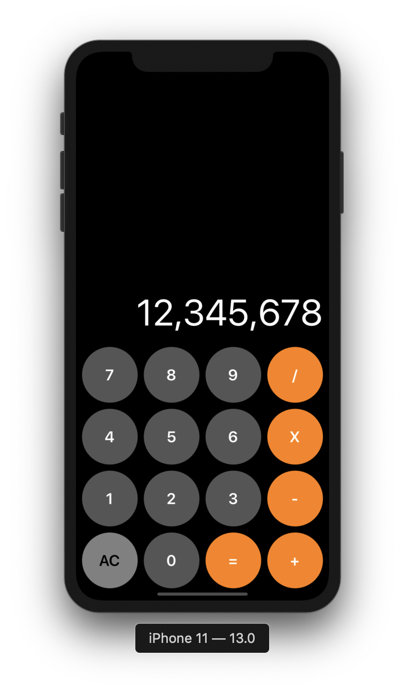

# KimNamSoo
김남수

## 목차

| 제목 | 내용 | 날짜 | 비고 |
|----|----|----|----|
| 1차 세미나 | iOS지식, VC간 이동, Hello Wolrd | 2019.09.28 |
| [1차 과제](#1차과제) | 단순한 기능의 인스타그램 따라하기 | ~2019.10.04 |
| 1차 보충세미나 | UIKit의 다양한 기능연습 | 2019.10.03 |
| 2차 세미나 | StackView, AutoLayout | 2019.10.12 |
| [2차 실습](#2차실습) | 로그인화면 키보드에 따른 뷰의 이동 | ~2019.10.19 |
| [2차 과제](#2차과제) | 계산기 | ~2019.10.25 |
| 3차 세미나 | ScrollView, PageControll, CocoaPods 사용 | 2019.10.26 | 2차 실습물에 추가 |
| 3차 과제 | TabbarController, 세미나때 못한 실습 마무리 | 2019.11.01 | 2차 실습물에 추가 |
| 4차 세미나 | Alamofire사용과 통신구현 | 2019.11.02 | 2차 실습물에 추가 |
| 4차 과제 | 회원가입통신 구현하기 | 2019.11.08 | 2차 실습물에 추가 |

***

## 1차과제

__기한: ~2019.10.04__

* 기능
    * 하트 누를시 하트가 채워지면서 글씨 나타남




***

## 2차실습

__기한: ~2019.10.19__

* 기능
    * AutoLayout 구현하기 <br>
        ✅ StoryBoard로 AutoLayout 구현 <br>
        ✅ Code로만 AutoLayout 구현
    * TextField클릭시 View들이 키보드의 높이에 맞춰서 위로 이동

<br>

### ❗생각할 점
    
* 코드로 AutoLayout을 구현할 시 NSLayoutConstraint를 가져와서 뷰의 이동을 설정 하는 것
    * 대체방안으로 CGAffineTransform을 이용 
    * -> 뷰하나만 적용되어 이동( 오토레이아웃 무시하고 적용된 뷰만 이동 )
    * -> 여러 뷰에 CGAffineTransform을 적용시켜서 이동하도록함
    
    <br>

``` swift
// 스토리보드로 오토레이아웃을 적용한 경우
// IBOutlet 오토레이아웃을 이용해서 애니메이션을 설정
@IBOutlet weak var idTextFieldUpLayout: NSLayoutConstraint!

UIView.animate(withDuration: duration, delay: 0.0, options: .init(rawValue: curve), animations: {
            
    //로고를 지우고, idTextField를 위로 이동시킴
    //현 originConstant = -160에서 키보드의 높이만큼 더해주면 위로 상승
    self.logoImage.alpha = 0
    self.idTextFieldUpLayout.constant = self.originConstant + self.keyboardHeight/2
            
})

``` 
``` swift
// 코드로 오토레이아웃을 적용한 경우
// 이동시킬 뷰들을 하나하나 애니메이션을 설정
UIView.animate(withDuration: duration, delay: 0 , animations: {
            
    self.logoImg.alpha = 0.0
            
    let trans = CGAffineTransform(translationX: 0, y: -keyboardHeight/2)
            
    self.idLabel.transform = trans
    self.idTextField.transform = trans
    self.idLine.transform = trans
    self.pwLabel.transform = trans
    self.pwTextField.transform = trans
    self.pwLine.transform = trans
    self.signBt.transform = trans
    self.loginBt.transform = trans
            
})
```



***

## 2차과제

__기한: ~2019.10.25__

* 기능
    * 코드로만 UI구성
    * 코드로만 AutoLayout을 적용시킨 StackView와 버튼
    * 3자리마다 ,(콤마)생성하기

### ❗생각할 점
* 더 좋은 계산기 알고리즘



